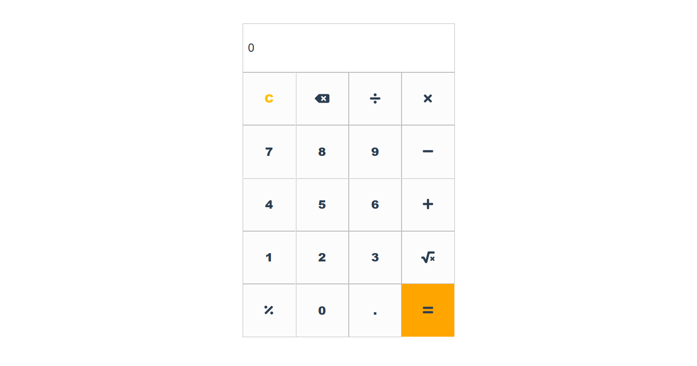

# calculator-vue


## Tech stack
* [Vue.js](https://vuejs.org/)
* [bootstrap-vue](https://bootstrap-vue.org/)
* [math.js](https://mathjs.org/)
* [vue-fontawesome](https://github.com/FortAwesome/vue-fontawesome)

## Project setup
```
npm install
```

### Compiles and hot-reloads for development
```
npm run serve
```

### Compiles and minifies for production
```
npm run build
```

### Lints and fixes files
```
npm run lint
```

### Customize configuration
See [Configuration Reference](https://cli.vuejs.org/config/).
